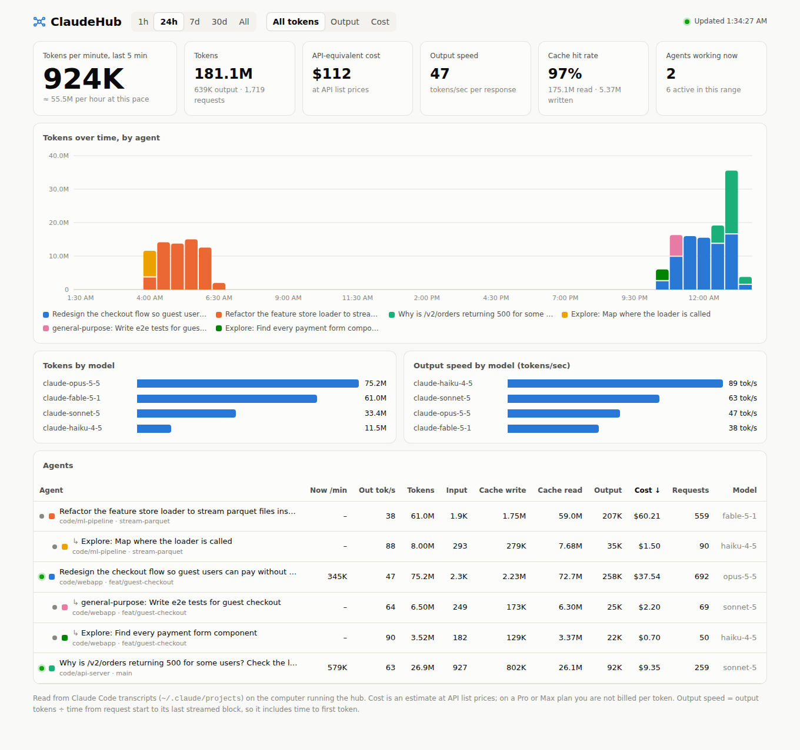

# ClaudeHub

A live dashboard for your Claude Code agents. It shows how many tokens each session and subagent uses, how fast they go, and what that would cost at API prices. From the same page you can send a message to any session.



- **Burn rate:** tokens (or output tokens, or dollars) per minute over the last 5 minutes, overall and per agent
- **Usage over time:** stacked by agent, for the last 1h / 24h / 7d / 30d / all time
- **Output speed:** output tokens per second, per agent and per model
- **Token breakdown:** input, cache write, cache read and output tokens, plus cache hit rate
- **Cost estimate:** at API list prices, per agent and per model
- **Live status:** which agents are working right now; subagents appear under the session that started them
- **Message a session:** a chat drawer that sends your message to the session and streams back its reply

## Quick start

You need Node.js 18 or newer. There are no dependencies to install.

```sh
git clone https://github.com/dddde6294-gif/ClaudeHub.git
cd ClaudeHub
node server.js
```

Then open the link it prints, `http://localhost:4317/#token=…`. Opening it once pairs that browser; after that, <http://localhost:4317> is enough.

To look around first with sample data, run `node server.js --demo`. To get a summary in the terminal instead, run `node server.js --report --range 7d`.

## The hosted page

The dashboard is also published with GitHub Pages at <https://dddde6294-gif.github.io/ClaudeHub/>. Until you pair it, that page shows demo data.

GitHub Pages only serves static files: it can't read files on your computer or run `claude`. So the hosted page works like this:

1. Run `node server.js` on your computer (the "hub").
2. Open the **Hosted dashboard** link the hub prints. It looks like `https://dddde6294-gif.github.io/ClaudeHub/#hub=…&token=…`.
3. Opening that link pairs the browser. From then on, the hosted page talks directly to the hub on your machine.

Privacy:

- Your transcripts never go to GitHub.
- The token is part of the `#fragment`, which browsers don't send to the server. The page stores the token locally and removes it from the address bar.
- The hub answers only requests that carry the token. It accepts cross-site requests only from the hosted page's origin, and it refuses requests addressed to any host name other than its own.
- The page the hub serves never contains the token, so other users on a shared computer can't pick it up.

If the browser asks whether the site may access apps or devices on your computer, choose **Allow**. Safari may block pages from reaching `localhost`; if so, use the local link the hub prints instead.

The pairing token is saved in `~/.claudehub/token`. Run with `--new-token` to replace it, which unpairs every browser.

### Turning on GitHub Pages (one time)

The workflow in `.github/workflows/pages.yml` runs the tests and deploys the page on every push to `main`. To turn it on:

- Go to **Settings → Pages → Build and deployment** and set **Source** to **GitHub Actions**.
- GitHub Pages on a private repository needs a paid GitHub plan. On the free plan, the repository has to be public.
- Either way, the published site is public. It contains only the page and made-up demo data.

## Messaging your agents

Click **Message** next to a session to open its conversation and send a message. The hub runs this in the session's own project directory:

```sh
claude -p --resume <session-id> --output-format stream-json …
```

The reply streams back into the drawer.

- **Send as a fork** continues in a copy of the session and leaves the original untouched. This is on by default when a session is working right now, because two processes writing to one session can interleave.
- Nobody is at a terminal to answer permission prompts, so any tool use that would ask for permission is denied. To allow more, start the hub with `--permission-mode acceptEdits`, or with another mode.
- You can only message sessions that ran on the computer running the hub. Subagents can't be messaged directly; message their parent session instead.
- Use `--no-messaging` for a read-only dashboard.

## What the numbers mean

| Number | How it's worked out |
|---|---|
| Tokens | input + cache writes + cache reads + output, from each response's `usage` |
| Cost | tokens × the API list prices in `lib/pricing.js`. Cache writes cost 1.25× input (5-minute cache) or 2× input (1-hour cache); cache reads have their own rate. On a Pro or Max plan you don't pay per token, so treat this as "what it would cost on the API". |
| Output speed | output tokens ÷ time from when a request started to its last streamed block. It includes the time to the first token, so it reads lower than a model's raw generation speed. Responses under 50 tokens are skipped. |
| Burn rate / Now /min | usage in the last 5 minutes ÷ 5 |
| Working now | the agent wrote to its transcript in the last 2 minutes |

Each response is counted once, even when Claude Code writes it over several lines or copies it into a resumed session.

## Where the data comes from

The hub reads the transcripts Claude Code writes as it works: `~/.claude/projects/**/*.jsonl` and `~/.config/claude/projects`, or `$CLAUDE_CONFIG_DIR/projects` if that's set. It reads only what's new every 3 seconds. That covers Claude Code in the terminal, IDE extensions, the desktop app and the Agent SDK on that computer.

Cloud sessions (Claude Code on the web) don't write transcripts to your computer, so they don't show up.

## Options

```
--port <n>              Port to listen on (default 4317)
--host <addr>           Address to bind (default 127.0.0.1)
--dir <path>            A Claude "projects" directory to read; repeatable
--claude-bin <path>     claude executable used to message sessions (default "claude")
--permission-mode <m>   Permission mode for messages sent from the hub
--no-messaging          Read-only: disable sending messages to sessions
--pages-url <url>       Hosted dashboard allowed to connect to this hub
--allow-origin <o>      Another web origin allowed to connect; repeatable
--token <value>         Pairing token to use instead of the saved one
--new-token             Replace the saved pairing token (unpairs old browsers)
--demo                  Show generated sample data instead of your transcripts
--report                Print a usage summary to the terminal and exit
--range <spec>          Time range for --report: 1h, 24h, 7d, 30d, all
```

## Development

```sh
npm test               # node --test
npm run build:pages    # writes the static site to _site/
```

- `lib/scanner.js`: incremental transcript reader
- `lib/stats.js`: aggregation
- `lib/pricing.js`: price table
- `lib/messenger.js`: the `claude --resume` bridge
- `lib/demo.js`: sample-data generator
- `public/index.html`: the whole dashboard; the hub and GitHub Pages serve the same file
