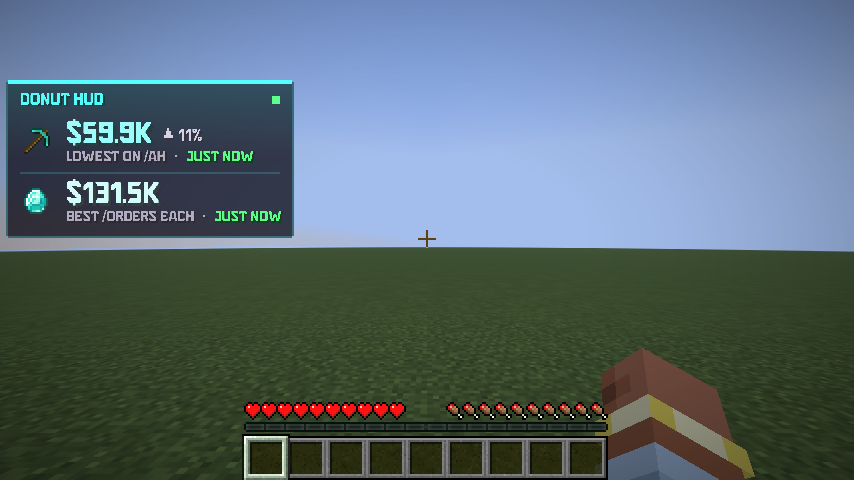
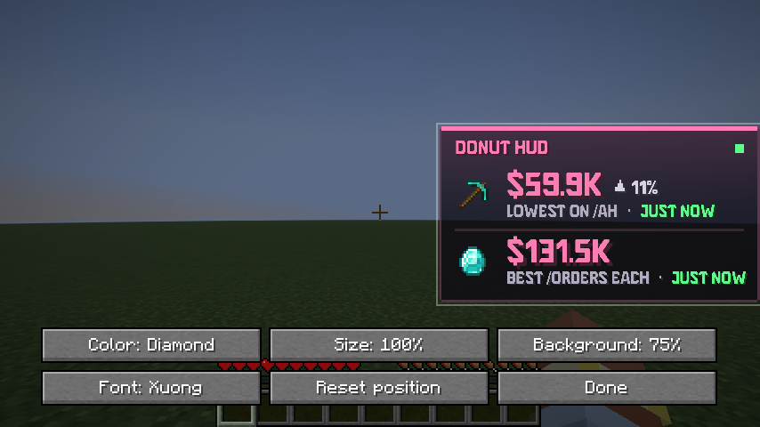

# Donut HUD (Fabric mod)

An in-game HUD for [DonutSMP](https://donutsmp.net) on Minecraft **1.21.11**. It shows:

- **Diamond Pickaxe:** the cheapest one listed on `/ah`
- **Diamond:** the best price per diamond in `/orders`



No API key needed: the mod reads the prices off the `/ah` and `/orders` menus while you have them open. It never clicks or sends anything. Each price shows how long ago you saw it: green under 2 minutes, then yellow, then red after 10. A ▲/▼ shows how much it moved since your previous check, and the price flashes when it changes.

It only runs on DonutSMP (`donutsmp.net` and its subdomains). On any other server or in singleplayer the HUD is hidden and the menus aren't read.

## Install

1. Install [Fabric Loader](https://fabricmc.net/use/installer/) for Minecraft 1.21.11.
2. Put [Fabric API](https://modrinth.com/mod/fabric-api) for 1.21.11 and `donut-hud-1.0.0.jar` in your `.minecraft/mods` folder.
3. Join DonutSMP and open `/ah diamond pickaxe` (sort by lowest price) and `/orders diamond`.

## Move it and style it

Press **Right Shift** on DonutSMP (change it in Options → Controls → Donut HUD), or type `/donuthud`.



- **Drag** the HUD anywhere. It snaps to the edges and the middle.
- **Scroll** on it to resize, or use the **Size** button. **Arrow keys** nudge it (Shift for bigger steps).
- **Color** cycles Diamond, Donut, Emerald, Gold, Amethyst, Redstone, Snow and Custom.
- **Background** sets how see-through the panel is. **Font** switches between Xuong and the Minecraft font.

Commands:

| Command | What it does |
|---|---|
| `/donuthud` | Opens the editor |
| `/donuthud color #ff66cc` | Any colour (also takes a theme name, like `/donuthud color gold`) |
| `/donuthud toggle` | Hides or shows the HUD |
| `/donuthud clear` | Forgets the saved prices |

Settings and the last prices are saved in `.minecraft/config/donuthud.json`.

## Font

The HUD uses [Xuong](https://github.com/TruongNguyenHuy/Xuong) by Truong Nguyen Huy, under the SIL Open Font License 1.1. The license is included in the jar at `assets/donuthud/font/Xuong-OFL.txt`.

## Building

Gradle and Fabric Loom 1.18 need **JDK 25** to run; the mod itself targets Java 21 like Minecraft 1.21.11.

```sh
./gradlew build              # the mod: build/libs/donut-hud-1.0.0.jar (runs the unit tests too)
./gradlew runClientGameTest  # starts the real game with a test server and checks the HUD end to end
```

The game test connects to a local test server, checks the HUD stays off there, then treats it as DonutSMP, opens `/ah` and `/orders` style menus, drags the HUD in the editor and saves screenshots to `build/run/clientGameTest/screenshots/`. It needs a display; on Linux run it under `xvfb-run`.

To try the HUD in singleplayer, start the game with `-Ddonuthud.anyServer=true`.
